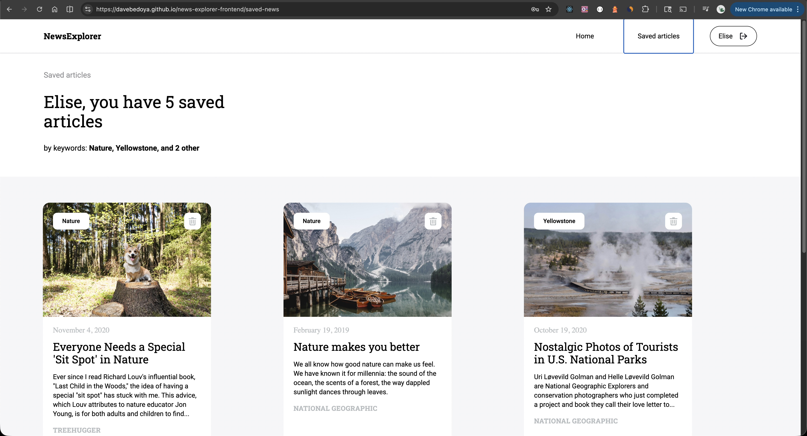
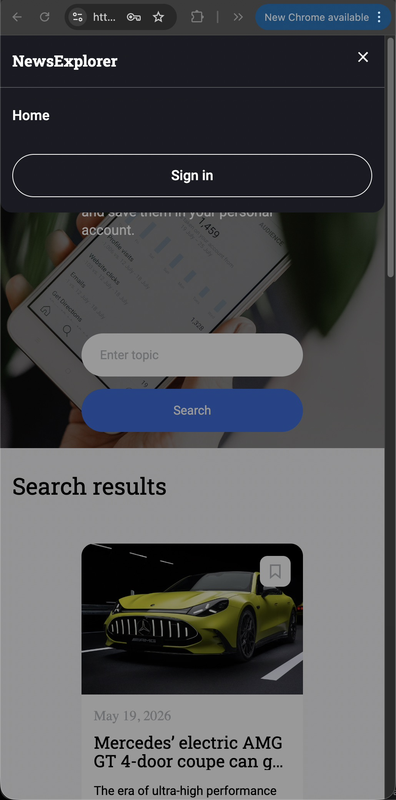

# News Explorer

News Explorer is a responsive React application that allows users to search for recent news articles using the News API and save articles to a personal collection.

## Technologies Used

- React
- Vite
- JavaScript
- CSS
- React Router
- News API

## Features

- Search for recent news articles using the News API
- Responsive desktop, tablet, and mobile layouts
- Saved articles page
- Login and registration modal flow
- Dynamic navigation based on authorization state
- API integration with asynchronous requests

## Screenshots

### Homepage

### Saved News Page

### Mobile Sign In Modal

### Mobile Navigation Menu

## Live Demo

https://davebedoya.github.io/news-explorer-frontend/

## Project Pitch Video

Check out [this video](https://www.loom.com/share/b10fa60c5ecf47d89f8c80cea2abb9f4), where I describe my project and some challenges I faced while building it.

## Author

David Bedoya
